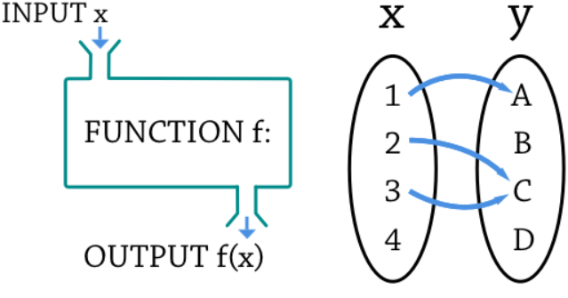
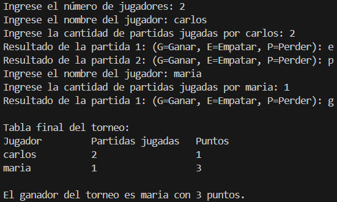

# FUNCIONES

## 1.-QUE SON LAS FUNCIONES EN PROGRAMACIÓN
### En programación, una función es una sección de un programa que calcula un valor de manera independiente al resto del programa. Una función se define de la siguiente manera:
   ```bash
   def nombre_función(argumentos):
      código
      return retorno
   ``` 
### Cualquier función tendrá un nombre, unos argumentos de entrada, un código a ejecutar y unos parámetros de salida. Al igual que las funciones matemáticas, en programación nos permiten realizar diferentes operaciones con la entrada, para entregar una determinada salida que dependerá del código que escribamos dentro. Por lo tanto, es totalmente análogo al clásico y=f(x) de las matemáticas.
   ```bash
   def f(x):
      return 2*x
   y=f(3)
   print(y) #6
   ```
[link de referencia](https://ellibrodepython.com/funciones-en-python)
### En este esquema, la función siempre representará la relación entre una entrada y una salida, tal como en matemáticas, en las que tienes que si a una función introduces un valor X, obtendrás como resultado un valor Y.


[link de referencia](https://thatcsharpguy.com/tv/funcional/)
## 2.-ARGUMENTOS DE ENTRADA
## Argumentos por posición:
### Los argumentos por posición o posicionales son la forma más básica e intuitiva de pasar parámetros. Si tenemos una función resta() que acepta dos parámetros, se puede llamar como se muestra a continuación.
   ```bash
   def resta(a,b):
      return a-b
   resta(5,3) #2
   ```
## Argumentos por nombre:
### Otra forma de llamar a una función, es usando el nombre del argumento con (=) y su valor. El siguiente código hace lo mismo que el código anterior, con la diferencia de que los argumentos no son posicionales.
   ```bash
   resta(a=3,b=5) #-2
   ```
## Argumentos por defecto:
### Tal vez queramos tener una función con algún parámetro opcional, que pueda ser usado o no dependiendo de diferentes circunstancias. Para ello, lo que podemos hacer es asignar un valor por defecto a la función. En el siguiente caso c valdría cero salvo que se indique lo contrario.
   ```bash
   def suma(a,b,c=0):
      return a+b+c
   suma(5,5,3) #13
   ```
## 3.-SENTENCIA RETURN
### El uso de la sentencia return permite:
### Salir de la función y transferir la ejecución de vuelta a donde se realizó la llamada.
### Devolver uno o varios parámetros, fruto de la ejecución de la función.
### En lo relativo a lo primero, una vez se llama a return se para la ejecución de la función y se vuelve o retorna al punto donde fue llamada. Es por ello por lo que el código que va después del return no es ejecutado en el siguiente ejemplo.
   ```bash
   def mi_función():
      print("Entra en mi_función")
      return
      print("No llega")
   mi_función() # Entra en mi_función
   ```
## 4.-EJEMPLO (Simulador de puntos para un torneo de videojuegos)
### Una universidad organiza un torneo de videojuegos. Cada jugador participa en varias partidas y recibe puntos según su rendimiento: Si gana una partida suma 3 puntos, si empata suma 1 punto y si pierde no suma puntos. El sistema debe:
### 1.Pedir el número de jugadores.
### 2.Por cada jugador, pedir su nombre y la cantidad de partidas jugadas.
### 3.Luego, para cada partida, pedir el resultado: "G" para ganar, "E" para empatar o "P" para perder.
### 4.Calcular el total de puntos de cada jugador.
### 5.Mostrar una tabla final con:Nombre del jugador - Partidas jugadas - Puntos obtenidos
### 6.Indicar el nombre del jugador con mayor puntaje (puede haber empate).
### 7.El código debe estar estructurado usando funciones.

Resultados esperados
